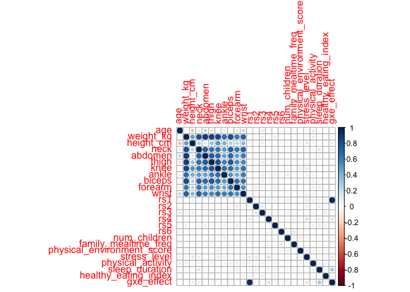

Case study: variable selection for the approximation of body fat
================
Lacey W. Heinsberg
November 08, 2024, 09:54


The purpose of this .Rmd file is to demonstrate variable selection and
multivariable modeling in a fictitious case study estimating body fat
percentage using simple anthropometric measures. This file uses source
code that accompanies section 3.3 of the manuscript [“Variable
selection: A review and recommendations for the practicing
statistician”](https://onlinelibrary.wiley.com/doi/full/10.1002/bimj.201700067)
that was created by Georg Heinze, Christine Wallisch, and Daniela
Dunkler. This code has been modified and annotated for the following
work:

Heinsberg LW. Statistical Tools to Support Implementation: Variable
Selection and Post-Selection Inference in Genomic Nursing Research.
(Expert Lecturer Abstract, Podium). Presented at the International
Society of Nurses in Genetics, November 2024, San Diego, California.

For questions, comments, or remarks, feel free to contact Lacey
Heinsberg (<law145@pitt.edu>).

# Define study question

This fictitious study aims to investigate the influence of genetic
variation (obesity-related SNPs), anthropometric measures, social
drivers of health (SDOH), and behavioral factors on a continuous measure
of body fat mass in adults aged 22-81 years.

Outcome Variable: \* Body fat

Explanatory Variables:

1.  Genetics

- rs1 to rs6: Obesity-related genetic markers (0 = no risk alleles, 1 =
  one risk allele, 2 = two risk alleles).
- Gene x Environment Effect: Interaction effect of rs1 and sleep
  duration.

2.  Demographics

- Age: Continuous (years)

3.  Anthropometrics

- Weight: Continuous (kg).
- Height: Continuous (cm).
- Circumference Values: neck, abdomen, thigh, knee, ankle, biceps,
  forearm, wrist: Continuous (cm).

4.  Family dynamics

- Number of Children in Household: Continuous, the total number of
  children living in the household.
- Family Mealtime Frequency: Continuous, number of family meals per week
  (0–21, right-skewed).

5.  Environmental factors

- Physical Environment Score: Composite continuous score, higher scores
  indicate a safer and more exercise-friendly environment.

6.  Psychosocial factors

- Stress Level: Continuous, with higher scores indicating more stress.

7.  Behavioral factors

- Physical Activity Level: Continuous, hours per day spent on physical
  activity.
- Sleep Duration: Continuous, hours of sleep per night.
- Healthy Eating Index: Continuous, with higher scores indicating better
  eating habits.

# Load libraries

``` r
library(shrink)
library(pander)
library(corrplot)
library(dplyr)
```

# Load and prepare data

The data set used for this example are from [Johnson’s
(1996)](https://www.tandfonline.com/doi/full/10.1080/10691898.1996.11910505)
body fat study which was intended as an educational data set to teach
multivariable linear regression in the classroom. The original purpose
of the data set was to support the approximation of a costly measurement
of body density (from which proportion of body fat can be derived with
[Siri’s
(1956)](https://www.sciencedirect.com/science/article/abs/pii/B978148323110550011X)
formula) by a combination of age, height, weight, and ten simple
anthropometric circumference measures through multivariable linear
regression. A more detailed description of the data can be found at:
<https://ww2.amstat.org/publications/jse/datasets/fat.txt>. In line with
other literature, Heinze, Wallisch, and Dunkler excluded one individual
from the original data set with an implausible height observation. The
team also converted the units of some variables for the approach
detailed below.

Before using the data, we are going to modify it a bit by adding some
simulated genetic data and nursing-centric covariates to support
discussion throughout this fictitious case study (detailed above under
“explanatory predictors”).

``` r
# Load data ------------------------------------------------------
case1.bodyfat <- read.table("data/case1_bodyfat.txt", header = T, sep = ";")
n <- nrow(case1.bodyfat)
```

``` r
# Expand data ----------------------------------------------------
# Set seed for reproducibility
set.seed(123)

# Simulate SNP data (rs1 to rs6) with varying minor allele frequencies (MAFs)
case1.bodyfat <- case1.bodyfat %>%
  mutate(
    rs1 = rbinom(n, 2, 0.3),  # rs1 with MAF of 0.3
    rs2 = rbinom(n, 2, 0.4),  # rs2 with MAF of 0.4
    rs3 = rbinom(n, 2, 0.2),  # rs3 with MAF of 0.2
    rs4 = rbinom(n, 2, 0.5),  # rs4 with MAF of 0.5
    rs5 = rbinom(n, 2, 0.3),  # rs5 with MAF of 0.3
    rs6 = rbinom(n, 2, 0.4)   # rs6 with MAF of 0.4
  )

# Simulate social drivers of health (SDOH) and behavioral factorss
case1.bodyfat <- case1.bodyfat %>%
  mutate(
    num_children = pmax(0, rpois(n, 2)),  # Number of children, minimum 0
    family_mealtime_freq = pmin(21, pmax(0, round(rlnorm(n, 2, 0.5)))),  # Family mealtime frequency, 0 and 21 meals per week
    physical_environment_score = rnorm(n, 50, 10), # Physical environment score (unitless)
    stress_level = pmin(10, pmax(0, rnorm(n, 5, 2))), # Stress, 0-10 with higher values indicating higher stress
    physical_activity = pmin(16, pmax(0, rnorm(n, 1, 0.5))), # Physical activity in hours per day, 0-16 hours per day
    sleep_duration = pmin(16, pmax(0, rnorm(n, 9, 2))), # Sleep duration in hours 0 to 16 hours
    healthy_eating_index = pmin(100, pmax(0, rnorm(n, 50, 10))) # Healthy eating index, 0-100 (unitless)
  )

# Create a GxE interaction effect (for added interest) 
case1.bodyfat <- case1.bodyfat %>%
  mutate(
    gxe_effect = rs1 * sleep_duration  # Interaction term between rs1 and sleep_duration
  )

# Create a new outcome that preserves the original siri structure with 
# added SNP and interaction effects (so we can pretend we are onto something BIG!)
case1.bodyfat <- case1.bodyfat %>%
  mutate(
    siri_simulated = siri + 1.5 * rs1 - 1.2 * rs2 - 0.4 * stress_level +
                    0.5 * physical_activity - 0.3 * (sleep_duration - 7)^2 + 
                    1.2 * gxe_effect 
  )

# Double the dataset for a larger sample size
duplicated_data <- case1.bodyfat[sample(1:n, n, replace = TRUE), ]
case1.bodyfat <- rbind(case1.bodyfat, duplicated_data)

# Check the size of the new dataset and preview the first few rows
n <- nrow(case1.bodyfat)
head(case1.bodyfat)
```

    ##   case brozek siri density age weight weight_kg height height_cm neck chest
    ## 1    1   12.6 12.3  1.0708  23 154.25      70.1  67.75       172 36.2  93.1
    ## 2    2    6.9  6.1  1.0853  22 173.25      78.8  72.25       184 38.5  93.6
    ## 3    3   24.6 25.3  1.0414  22 154.00      70.0  66.25       168 34.0  95.8
    ## 4    4   10.9 10.4  1.0751  26 184.75      84.0  72.25       184 37.4 101.8
    ## 5    5   27.8 28.7  1.0340  24 184.25      83.8  71.25       181 34.4  97.3
    ## 6    6   20.6 20.9  1.0502  24 210.25      95.6  74.75       190 39.0 104.5
    ##   abdomen   hip thigh knee ankle biceps forearm wrist rs1 rs2 rs3 rs4 rs5 rs6
    ## 1    85.2  94.5  59.0 37.3  21.9   32.0    27.4  17.1   0   0   0   0   1   2
    ## 2    83.0  98.7  58.7 37.3  23.4   30.5    28.9  18.2   1   1   0   1   0   0
    ## 3    87.9  99.2  59.6 38.9  24.0   28.8    25.2  16.6   0   0   0   1   1   0
    ## 4    86.4 101.2  60.1 37.3  22.8   32.4    29.4  18.2   1   1   0   1   0   2
    ## 5   100.0 101.9  63.2 42.2  24.0   32.2    27.7  17.7   2   1   0   2   0   1
    ## 6    94.4 107.8  66.0 42.0  25.6   35.7    30.6  18.8   0   0   0   0   0   0
    ##   num_children family_mealtime_freq physical_environment_score stress_level
    ## 1            2                    7                   70.95705     3.884423
    ## 2            2                   16                   60.90176     4.363083
    ## 3            2                    3                   38.54626     4.558916
    ## 4            2                    7                   29.45192     3.840704
    ## 5            2                   21                   62.58065     5.377836
    ## 6            5                    6                   43.52461     4.297470
    ##   physical_activity sleep_duration healthy_eating_index gxe_effect
    ## 1         1.2085865      11.086203             49.11380    0.00000
    ## 2         1.9078413      14.081942             65.61617   14.08194
    ## 3         0.7157718       7.876441             59.66893    0.00000
    ## 4         0.7950628      12.488092             49.49942   12.48809
    ## 5         0.7437824       6.717081             34.27745   13.43416
    ## 6         0.7138788      10.818667             46.77544    0.00000
    ##   siri_simulated
    ## 1       6.341407
    ## 2       7.460846
    ## 3      23.603875
    ## 4      15.511214
    ## 5      44.817738
    ## 6      15.163286

Our example data set consists of 502 participants with data on body fat
(variable name `siri_simulated`, our outcome of interest) and several
candidate variables hypothesized to be related to body fat.

# Analyses

## Events-per-variable (EPV)

The ratio between sample size and the number of independent variables is
termed “events-per-variable” (EPV). EPV quantifies the balance between
the amount of information provided by the data and the number of unknown
parameters that should be estimated.

With a limited sample size, it is not possible to accurately estimate
many regression coefficients. Therefore, EPV “rules of thumb” (such as
that recommend in Table 3 of [Heinze, Wallisch, and Dunkler
(2018)](https://onlinelibrary.wiley.com/doi/full/10.1002/bimj.201700067))
can be considered when developing your analytical approach.

For an expanded commentary on EPV, see section 2.1.3 of [Heinze,
Wallisch, and Dunkler
(2018)](https://onlinelibrary.wiley.com/doi/full/10.1002/bimj.201700067).

Let’s calculate the EPV for our example data set.

``` r
# EPV --------------------------------------------------------------
# Store predictors of interest
pred <- c("age", "weight_kg", "height_cm", "neck",  "abdomen",  
          "thigh", "knee", "ankle", "biceps", "forearm", "wrist", "rs1", "rs2", "rs3", "rs4", "rs5", "rs6", "num_children", "family_mealtime_freq", "physical_environment_score", "stress_level", "physical_activity", "sleep_duration", "healthy_eating_index", "gxe_effect" )

# Compute EPV 
epv <- dim(case1.bodyfat)[1] / length(pred)
epv
```

    ## [1] 20.08

In our example data set, we have an acceptable EPV of 20.08.

## Correlation structure

Note that the EPV ratio above often oversimplifies the analytical
approach because - beyond the number of independent variables - many
other quantities such as the correlation structure of a data set may
influence accuracy [(Courvoisier, Combescure, Agoritsas, Gayet-Ageron, &
Perneger, 2011)](https://pubmed.ncbi.nlm.nih.gov/21411281/). The
recommended EPV limits should be adapted to the situation (e.g., raised
if correlations between candidate independent variables are particularly
strong; lowered if candidate variables are all independent of each
other) [(Heinze, Wallisch, and Dunkler,
2018)](https://onlinelibrary.wiley.com/doi/full/10.1002/bimj.201700067).

Further, strong correlations impose some challenges in model development
and interpretation. In particular, interpretation of regression
coefficients as adjusted effects in the global model, or, if variable
selection is applied, interpretation of non-selected variables as
“non-predictive” can be problematic. As such, understanding the
correlation structure of our data set is very important.

Let’s examine it now.

``` r
# Correlation structure --------------------------------------------
#pander(cor(case1.bodyfat[, pred]))
cor(case1.bodyfat[, pred])
```

    ##                                     age    weight_kg    height_cm         neck
    ## age                         1.000000000 -0.012473289 -0.264547431  0.122836898
    ## weight_kg                  -0.012473289  1.000000000  0.468743490  0.804624860
    ## height_cm                  -0.264547431  0.468743490  1.000000000  0.263999656
    ## neck                        0.122836898  0.804624860  0.263999656  1.000000000
    ## abdomen                     0.234332474  0.883903886  0.142581296  0.732777357
    ## thigh                      -0.177907106  0.862967624  0.335706876  0.648702039
    ## knee                        0.008151846  0.835245387  0.515833559  0.628996347
    ## ankle                      -0.123522030  0.660915275  0.419694902  0.486881423
    ## biceps                     -0.019432557  0.807846989  0.277255377  0.731546394
    ## forearm                    -0.126198361  0.620947178  0.264378229  0.617401350
    ## wrist                       0.216788522  0.723783621  0.381868268  0.734571058
    ## rs1                        -0.014343073  0.007233533  0.096563915  0.029609351
    ## rs2                        -0.026299331 -0.041001505  0.042435432 -0.009340582
    ## rs3                         0.144822514 -0.123739448 -0.134514174 -0.033448808
    ## rs4                        -0.009382545 -0.028238618  0.043123760  0.004635053
    ## rs5                        -0.013680142 -0.107566007  0.003148046 -0.090704416
    ## rs6                         0.066318059 -0.002413175 -0.072183956  0.040363150
    ## num_children                0.016674833  0.008047266  0.050349829 -0.073308479
    ## family_mealtime_freq        0.035496345 -0.026312494 -0.038792570  0.053891667
    ## physical_environment_score -0.023625937 -0.040443375 -0.102227512 -0.001795568
    ## stress_level               -0.065317726 -0.089343332 -0.146996829 -0.087473031
    ## physical_activity          -0.125333352  0.101208284  0.060560032  0.068947654
    ## sleep_duration             -0.045370518  0.054958471 -0.009390837  0.145842595
    ## healthy_eating_index        0.013656134 -0.001971380  0.009322603 -0.008543540
    ## gxe_effect                 -0.033433580  0.033971210  0.127129015  0.083502051
    ##                                 abdomen        thigh         knee         ankle
    ## age                         0.234332474 -0.177907106  0.008151846 -0.1235220300
    ## weight_kg                   0.883903886  0.862967624  0.835245387  0.6609152748
    ## height_cm                   0.142581296  0.335706876  0.515833559  0.4196949023
    ## neck                        0.732777357  0.648702039  0.628996347  0.4868814232
    ## abdomen                     1.000000000  0.750725439  0.687544568  0.4837914678
    ## thigh                       0.750725439  1.000000000  0.794117700  0.5947223930
    ## knee                        0.687544568  0.794117700  1.000000000  0.6623299180
    ## ankle                       0.483791468  0.594722393  0.662329918  1.0000000000
    ## biceps                      0.688318392  0.766172241  0.666693059  0.5101157250
    ## forearm                     0.475999211  0.539337347  0.501273797  0.4395966308
    ## wrist                       0.597521122  0.560753638  0.660541013  0.6013304640
    ## rs1                        -0.010085843  0.033114011  0.008891214 -0.0134901879
    ## rs2                        -0.082647901 -0.044182519 -0.034609443 -0.0314046737
    ## rs3                        -0.070147640 -0.128759229 -0.080267925 -0.1295937280
    ## rs4                        -0.037744344 -0.004073317 -0.005299212 -0.0677183590
    ## rs5                        -0.122643533 -0.084702744 -0.088092018 -0.1072558904
    ## rs6                         0.027754029 -0.030633326 -0.029251914 -0.0494071946
    ## num_children                0.000892749 -0.055640412  0.046270922  0.1219989797
    ## family_mealtime_freq       -0.025047951 -0.061080829  0.003447670 -0.0582530378
    ## physical_environment_score -0.023315808 -0.044621040 -0.135588647 -0.0591792502
    ## stress_level               -0.043791851 -0.067454550 -0.139450496 -0.0793668354
    ## physical_activity           0.054384206  0.089799853  0.030150657  0.0823963070
    ## sleep_duration              0.079872316  0.018174307 -0.017622921 -0.0370978305
    ## healthy_eating_index       -0.049410790 -0.018465531  0.019224538  0.0124299860
    ## gxe_effect                  0.012926626  0.039442397  0.012246082  0.0009520716
    ##                                  biceps       forearm        wrist          rs1
    ## age                        -0.019432557 -0.1261983608  0.216788522 -0.014343073
    ## weight_kg                   0.807846989  0.6209471785  0.723783621  0.007233533
    ## height_cm                   0.277255377  0.2643782291  0.381868268  0.096563915
    ## neck                        0.731546394  0.6174013504  0.734571058  0.029609351
    ## abdomen                     0.688318392  0.4759992106  0.597521122 -0.010085843
    ## thigh                       0.766172241  0.5393373473  0.560753638  0.033114011
    ## knee                        0.666693059  0.5012737970  0.660541013  0.008891214
    ## ankle                       0.510115725  0.4395966308  0.601330464 -0.013490188
    ## biceps                      1.000000000  0.6434320138  0.633792033  0.012488322
    ## forearm                     0.643432014  1.0000000000  0.525030408 -0.038550708
    ## wrist                       0.633792033  0.5250304079  1.000000000 -0.057242941
    ## rs1                         0.012488322 -0.0385507082 -0.057242941  1.000000000
    ## rs2                        -0.031047219 -0.1358093360 -0.002127615  0.080617496
    ## rs3                        -0.111279083 -0.1008329570 -0.035326076  0.003718642
    ## rs4                         0.055713614  0.0212378102  0.032854072  0.128711492
    ## rs5                        -0.074571711 -0.1288108334 -0.053868442  0.084754736
    ## rs6                        -0.014489094  0.0060975130 -0.017267149  0.035853637
    ## num_children               -0.034953690 -0.0086225282  0.041743492 -0.120640676
    ## family_mealtime_freq       -0.002159597 -0.0221277339  0.010354974  0.032534665
    ## physical_environment_score  0.010882735 -0.0105580046 -0.070752598  0.021249587
    ## stress_level               -0.063635038  0.0274210776 -0.102133617 -0.138599663
    ## physical_activity           0.109311091  0.1040988834  0.089911849 -0.110336669
    ## sleep_duration              0.068982842  0.1190816332 -0.009478954  0.088170187
    ## healthy_eating_index        0.020644023  0.0158770827  0.087955713 -0.081554334
    ## gxe_effect                  0.041564757  0.0005113725 -0.036474320  0.952142496
    ##                                     rs2          rs3          rs4          rs5
    ## age                        -0.026299331  0.144822514 -0.009382545 -0.013680142
    ## weight_kg                  -0.041001505 -0.123739448 -0.028238618 -0.107566007
    ## height_cm                   0.042435432 -0.134514174  0.043123760  0.003148046
    ## neck                       -0.009340582 -0.033448808  0.004635053 -0.090704416
    ## abdomen                    -0.082647901 -0.070147640 -0.037744344 -0.122643533
    ## thigh                      -0.044182519 -0.128759229 -0.004073317 -0.084702744
    ## knee                       -0.034609443 -0.080267925 -0.005299212 -0.088092018
    ## ankle                      -0.031404674 -0.129593728 -0.067718359 -0.107255890
    ## biceps                     -0.031047219 -0.111279083  0.055713614 -0.074571711
    ## forearm                    -0.135809336 -0.100832957  0.021237810 -0.128810833
    ## wrist                      -0.002127615 -0.035326076  0.032854072 -0.053868442
    ## rs1                         0.080617496  0.003718642  0.128711492  0.084754736
    ## rs2                         1.000000000  0.141129523  0.024081185  0.006180764
    ## rs3                         0.141129523  1.000000000  0.001738431  0.040253050
    ## rs4                         0.024081185  0.001738431  1.000000000  0.071634009
    ## rs5                         0.006180764  0.040253050  0.071634009  1.000000000
    ## rs6                         0.021816198 -0.013903627 -0.055273986 -0.012352109
    ## num_children               -0.057551679 -0.089194721  0.013251446 -0.033349378
    ## family_mealtime_freq       -0.041202999 -0.046748157 -0.100697438 -0.059803816
    ## physical_environment_score  0.063656022 -0.041173078 -0.075791199 -0.051385351
    ## stress_level                0.133709014  0.025882212  0.173746386 -0.087456117
    ## physical_activity          -0.035172273 -0.103936068  0.045695936 -0.104946723
    ## sleep_duration             -0.141980817  0.010764538  0.105985308 -0.125656683
    ## healthy_eating_index        0.041070429  0.109829390  0.030700543 -0.091408781
    ## gxe_effect                  0.031382391 -0.008795107  0.173892850  0.048180754
    ##                                     rs6 num_children family_mealtime_freq
    ## age                         0.066318059  0.016674833          0.035496345
    ## weight_kg                  -0.002413175  0.008047266         -0.026312494
    ## height_cm                  -0.072183956  0.050349829         -0.038792570
    ## neck                        0.040363150 -0.073308479          0.053891667
    ## abdomen                     0.027754029  0.000892749         -0.025047951
    ## thigh                      -0.030633326 -0.055640412         -0.061080829
    ## knee                       -0.029251914  0.046270922          0.003447670
    ## ankle                      -0.049407195  0.121998980         -0.058253038
    ## biceps                     -0.014489094 -0.034953690         -0.002159597
    ## forearm                     0.006097513 -0.008622528         -0.022127734
    ## wrist                      -0.017267149  0.041743492          0.010354974
    ## rs1                         0.035853637 -0.120640676          0.032534665
    ## rs2                         0.021816198 -0.057551679         -0.041202999
    ## rs3                        -0.013903627 -0.089194721         -0.046748157
    ## rs4                        -0.055273986  0.013251446         -0.100697438
    ## rs5                        -0.012352109 -0.033349378         -0.059803816
    ## rs6                         1.000000000  0.061192723          0.148288868
    ## num_children                0.061192723  1.000000000         -0.052400788
    ## family_mealtime_freq        0.148288868 -0.052400788          1.000000000
    ## physical_environment_score  0.055913529 -0.130034978          0.008394799
    ## stress_level                0.022249600 -0.078688954         -0.051780538
    ## physical_activity           0.018941312  0.025862691         -0.002868198
    ## sleep_duration             -0.003311883  0.072456924         -0.079520005
    ## healthy_eating_index        0.013804103  0.019758770          0.015049586
    ## gxe_effect                  0.023946359 -0.101821384         -0.022328980
    ##                            physical_environment_score stress_level
    ## age                                      -0.023625937  -0.06531773
    ## weight_kg                                -0.040443375  -0.08934333
    ## height_cm                                -0.102227512  -0.14699683
    ## neck                                     -0.001795568  -0.08747303
    ## abdomen                                  -0.023315808  -0.04379185
    ## thigh                                    -0.044621040  -0.06745455
    ## knee                                     -0.135588647  -0.13945050
    ## ankle                                    -0.059179250  -0.07936684
    ## biceps                                    0.010882735  -0.06363504
    ## forearm                                  -0.010558005   0.02742108
    ## wrist                                    -0.070752598  -0.10213362
    ## rs1                                       0.021249587  -0.13859966
    ## rs2                                       0.063656022   0.13370901
    ## rs3                                      -0.041173078   0.02588221
    ## rs4                                      -0.075791199   0.17374639
    ## rs5                                      -0.051385351  -0.08745612
    ## rs6                                       0.055913529   0.02224960
    ## num_children                             -0.130034978  -0.07868895
    ## family_mealtime_freq                      0.008394799  -0.05178054
    ## physical_environment_score                1.000000000   0.09288927
    ## stress_level                              0.092889275   1.00000000
    ## physical_activity                         0.071322825  -0.02681089
    ## sleep_duration                           -0.092325758   0.02224425
    ## healthy_eating_index                     -0.080280844   0.06358454
    ## gxe_effect                               -0.025224826  -0.14670587
    ##                            physical_activity sleep_duration
    ## age                             -0.125333352   -0.045370518
    ## weight_kg                        0.101208284    0.054958471
    ## height_cm                        0.060560032   -0.009390837
    ## neck                             0.068947654    0.145842595
    ## abdomen                          0.054384206    0.079872316
    ## thigh                            0.089799853    0.018174307
    ## knee                             0.030150657   -0.017622921
    ## ankle                            0.082396307   -0.037097831
    ## biceps                           0.109311091    0.068982842
    ## forearm                          0.104098883    0.119081633
    ## wrist                            0.089911849   -0.009478954
    ## rs1                             -0.110336669    0.088170187
    ## rs2                             -0.035172273   -0.141980817
    ## rs3                             -0.103936068    0.010764538
    ## rs4                              0.045695936    0.105985308
    ## rs5                             -0.104946723   -0.125656683
    ## rs6                              0.018941312   -0.003311883
    ## num_children                     0.025862691    0.072456924
    ## family_mealtime_freq            -0.002868198   -0.079520005
    ## physical_environment_score       0.071322825   -0.092325758
    ## stress_level                    -0.026810891    0.022244246
    ## physical_activity                1.000000000    0.104744558
    ## sleep_duration                   0.104744558    1.000000000
    ## healthy_eating_index             0.059091300   -0.041097518
    ## gxe_effect                      -0.072172554    0.295644909
    ##                            healthy_eating_index    gxe_effect
    ## age                                 0.013656134 -0.0334335797
    ## weight_kg                          -0.001971380  0.0339712097
    ## height_cm                           0.009322603  0.1271290154
    ## neck                               -0.008543540  0.0835020508
    ## abdomen                            -0.049410790  0.0129266255
    ## thigh                              -0.018465531  0.0394423971
    ## knee                                0.019224538  0.0122460819
    ## ankle                               0.012429986  0.0009520716
    ## biceps                              0.020644023  0.0415647570
    ## forearm                             0.015877083  0.0005113725
    ## wrist                               0.087955713 -0.0364743203
    ## rs1                                -0.081554334  0.9521424955
    ## rs2                                 0.041070429  0.0313823915
    ## rs3                                 0.109829390 -0.0087951067
    ## rs4                                 0.030700543  0.1738928501
    ## rs5                                -0.091408781  0.0481807544
    ## rs6                                 0.013804103  0.0239463588
    ## num_children                        0.019758770 -0.1018213842
    ## family_mealtime_freq                0.015049586 -0.0223289804
    ## physical_environment_score         -0.080280844 -0.0252248257
    ## stress_level                        0.063584541 -0.1467058707
    ## physical_activity                   0.059091300 -0.0721725536
    ## sleep_duration                     -0.041097518  0.2956449093
    ## healthy_eating_index                1.000000000 -0.0784497023
    ## gxe_effect                         -0.078449702  1.0000000000

``` r
#cor_matrix <- cor(case1.bodyfat[, pred], use = "complete.obs")
#upper_tri <- cor_matrix[upper.tri(cor_matrix)]
#num_strong_correlations <- sum(upper_tri > 0.5)
corrplot(round(cor(case1.bodyfat[, pred]),2))
```

<!-- -->

An interesting feature of this data set is that many of the
anthropometric measures are intrinsically correlated. For example,
weight and abdomen circumference have a Pearson correlation coefficient
of 0.88. Further, many pairs have correlation coefficients greater than
0.5. As described above, these high correlations impose some challenges
in model development and interpretation.

## Regression

Based on our scientific expertise, let’s say we believe that abdominal
circumference and height are two central independent variables for
estimating body fat. As such, we will not subject these to variable
selection (i.e., we will “force” them into all models). We further
believe that all other independent variables may be strongly
interrelated and exchangeable when used for body fat estimation.
Therefore, we will subject them to backward elimination with AIC as
stopping criterion.

### Full model

First estimate the global (i.e., full) model which includes all
candidate independent variables.

``` r
# Estimate full model ----------------------------------------------
formula <- paste("siri_simulated~", paste(pred, collapse = "+"))
full_mod <- lm(formula, data = case1.bodyfat, x = T, y = T)
full_est <- coef(full_mod)
full_se <- coef(summary(full_mod))[, "Std. Error"]
#pander(summary(full_mod))
summary(full_mod)
```

    ## 
    ## Call:
    ## lm(formula = formula, data = case1.bodyfat, x = T, y = T)
    ## 
    ## Residuals:
    ##      Min       1Q   Median       3Q      Max 
    ## -18.6516  -2.8468  -0.1146   2.7869  10.7738 
    ## 
    ## Coefficients:
    ##                              Estimate Std. Error t value Pr(>|t|)    
    ## (Intercept)                -1.744e+01  1.522e+01  -1.146 0.252428    
    ## age                         5.218e-02  2.608e-02   2.001 0.046010 *  
    ## weight_kg                  -2.042e-01  9.740e-02  -2.096 0.036605 *  
    ## height_cm                  -1.277e-02  5.681e-02  -0.225 0.822196    
    ## neck                       -3.987e-01  1.964e-01  -2.030 0.042890 *  
    ## abdomen                     9.577e-01  7.291e-02  13.135  < 2e-16 ***
    ## thigh                       1.858e-01  1.073e-01   1.732 0.083920 .  
    ## knee                       -1.661e-01  2.006e-01  -0.828 0.408029    
    ## ankle                      -1.240e-01  2.163e-01  -0.573 0.566853    
    ## biceps                      1.464e-01  1.400e-01   1.046 0.296145    
    ## forearm                     4.145e-01  1.495e-01   2.773 0.005776 ** 
    ## wrist                      -1.827e+00  4.413e-01  -4.141 4.09e-05 ***
    ## rs1                         3.874e+00  1.556e+00   2.490 0.013122 *  
    ## rs2                        -1.274e+00  3.303e-01  -3.857 0.000131 ***
    ## rs3                         7.106e-01  3.953e-01   1.798 0.072877 .  
    ## rs4                        -3.164e-01  3.285e-01  -0.963 0.335982    
    ## rs5                         8.264e-01  3.550e-01   2.328 0.020347 *  
    ## rs6                         8.070e-02  3.259e-01   0.248 0.804497    
    ## num_children                1.501e-01  1.549e-01   0.969 0.332913    
    ## family_mealtime_freq        2.933e-02  5.310e-02   0.552 0.580965    
    ## physical_environment_score -4.278e-04  2.195e-02  -0.019 0.984455    
    ## stress_level               -2.942e-01  1.136e-01  -2.589 0.009911 ** 
    ## physical_activity           3.706e-01  4.843e-01   0.765 0.444543    
    ## sleep_duration             -1.171e+00  1.414e-01  -8.281 1.25e-15 ***
    ## healthy_eating_index        3.348e-02  2.266e-02   1.478 0.140170    
    ## gxe_effect                  8.576e-01  1.676e-01   5.118 4.48e-07 ***
    ## ---
    ## Signif. codes:  0 '***' 0.001 '**' 0.01 '*' 0.05 '.' 0.1 ' ' 1
    ## 
    ## Residual standard error: 4.717 on 476 degrees of freedom
    ## Multiple R-squared:  0.8469, Adjusted R-squared:  0.8389 
    ## F-statistic: 105.3 on 25 and 476 DF,  p-value: < 2.2e-16

### Selected model

Next, use backwards elimination to identify the “selected” model using
R’s built in approach.

``` r
# Selected model ---------------------------------------------------
sel_mod <- step(lm(formula, data = case1.bodyfat,  x=T,y=T), 
                direction = "backward",
                scope = list(upper = formula, 
                             # Force height and abdomen circumference into the model
                             lower = formula(siri_simulated~abdomen+height_cm)),
                trace = 0)
#pander(summary(sel_mod))

sel_est <- coef(sel_mod)[c("(Intercept)", pred)]
sel_est[is.na(sel_est)] <- 0
names(sel_est) <- c("(Intercept)", pred)
sel_se <- coef(summary(sel_mod))[, "Std. Error"][c("(Intercept)", pred)]
sel_se[is.na(sel_se)] <- 0

summary(sel_mod)
```

    ## 
    ## Call:
    ## lm(formula = siri_simulated ~ age + weight_kg + height_cm + neck + 
    ##     abdomen + thigh + forearm + wrist + rs1 + rs2 + rs3 + rs5 + 
    ##     stress_level + sleep_duration + healthy_eating_index + gxe_effect, 
    ##     data = case1.bodyfat, x = T, y = T)
    ## 
    ## Residuals:
    ##     Min      1Q  Median      3Q     Max 
    ## -18.859  -2.954  -0.070   2.825  11.145 
    ## 
    ## Coefficients:
    ##                       Estimate Std. Error t value Pr(>|t|)    
    ## (Intercept)          -15.00633   14.15225  -1.060 0.289513    
    ## age                    0.04878    0.02479   1.967 0.049726 *  
    ## weight_kg             -0.18793    0.08853  -2.123 0.034274 *  
    ## height_cm             -0.04205    0.05298  -0.794 0.427794    
    ## neck                  -0.35806    0.18687  -1.916 0.055942 .  
    ## abdomen                0.94901    0.06988  13.580  < 2e-16 ***
    ## thigh                  0.14729    0.09353   1.575 0.115953    
    ## forearm                0.44394    0.14454   3.071 0.002251 ** 
    ## wrist                 -1.91995    0.41510  -4.625 4.80e-06 ***
    ## rs1                    4.09367    1.48647   2.754 0.006109 ** 
    ## rs2                   -1.26072    0.32707  -3.855 0.000132 ***
    ## rs3                    0.60125    0.38794   1.550 0.121826    
    ## rs5                    0.80026    0.34694   2.307 0.021494 *  
    ## stress_level          -0.32966    0.10864  -3.034 0.002540 ** 
    ## sleep_duration        -1.13807    0.13865  -8.208 2.04e-15 ***
    ## healthy_eating_index   0.03545    0.02240   1.582 0.114213    
    ## gxe_effect             0.82397    0.15929   5.173 3.38e-07 ***
    ## ---
    ## Signif. codes:  0 '***' 0.001 '**' 0.01 '*' 0.05 '.' 0.1 ' ' 1
    ## 
    ## Residual standard error: 4.698 on 485 degrees of freedom
    ## Multiple R-squared:  0.8453, Adjusted R-squared:  0.8402 
    ## F-statistic: 165.6 on 16 and 485 DF,  p-value: < 2.2e-16

Observation: We identify a model where several variables were dropped
(reducing from 25 variables to 16). The adjusted R^2 only slightly
increases from from the global model to the selected model.

(Note that the coefficients and p-values for this model are identical to
those if we a priori selected the variables for glm)

### Bootstrap model

Finally, repeat backwards elimination using bootstrapping for a
stability investigation and valid post-selection inference measures.

``` r
# Bootstrap ----------------------------------------------------------
# Set number of bootstraps 
bootnum <- 1000 # NOTE: This may take some time. If you are troubleshooting your code, temporarily reduce this to 100
# Set up matrix for results 
boot_est <-  boot_se <- matrix(0, ncol = length(pred) + 1, nrow = bootnum,
                               dimnames = list(NULL, c("(Intercept)", pred)))
# Set seed for reproducible results 
set.seed(5437854)
# Perform bootstrapping (sampling with replacement)
for (i in 1:bootnum) {
  data_id <- sample(1:dim(case1.bodyfat)[1], replace = T)
  boot_mod <- step(lm(formula, data = case1.bodyfat[data_id, ], 
                             x=T, y=T), 
                         scope = list(upper = formula, 
                                      lower = 
                                        # Again forcing height and abdominal circumference
                                        # into all models 
                                        formula(siri_simulated ~ abdomen + height_cm)),
                         direction = "backward", trace = 0)
  boot_est[i, names(coef(boot_mod))] <- coef(boot_mod)
  boot_se[i, names(coef(boot_mod))] <- coef(summary(boot_mod))[, "Std. Error"]
}

# Compute final bootstrap estimates as the median 
boot_median <- apply(boot_est, 2, median)
boot_025per <- apply(boot_est, 2, function(x) quantile(x, 0.025))
boot_975per <- apply(boot_est, 2, function(x) quantile(x, 0.975))
boot.temp <- cbind(boot_median, boot_025per, boot_975per)
#pander(boot.temp)
boot.temp
```

    ##                             boot_median  boot_025per boot_975per
    ## (Intercept)                -14.49748948 -46.36720000 20.22024775
    ## age                          0.05122974   0.00000000  0.10443557
    ## weight_kg                   -0.19286373  -0.38524101  0.00000000
    ## height_cm                   -0.02863082  -0.14714882  0.08253272
    ## neck                        -0.42619473  -0.81423700  0.00000000
    ## abdomen                      0.95304475   0.77897646  1.10211156
    ## thigh                        0.16428842   0.00000000  0.34458273
    ## knee                         0.00000000  -0.55812681  0.00000000
    ## ankle                        0.00000000  -0.58718315  0.35815279
    ## biceps                       0.00000000   0.00000000  0.41853519
    ## forearm                      0.40217735   0.00000000  0.64834995
    ## wrist                       -1.83441979  -2.72611623 -0.91962243
    ## rs1                          3.95078789   0.00000000  7.69587481
    ## rs2                         -1.31220687  -1.92881271 -0.65491007
    ## rs3                          0.71648638   0.00000000  1.43504567
    ## rs4                          0.00000000  -0.93029182  0.00000000
    ## rs5                          0.82877450   0.00000000  1.53765218
    ## rs6                          0.00000000  -0.56371002  0.72569382
    ## num_children                 0.00000000  -0.21595614  0.49808378
    ## family_mealtime_freq         0.00000000  -0.08284351  0.13676319
    ## physical_environment_score   0.00000000  -0.04272427  0.04270156
    ## stress_level                -0.29999599  -0.55420879  0.00000000
    ## physical_activity            0.00000000   0.00000000  1.28820797
    ## sleep_duration              -1.17856867  -1.63990320 -0.75528398
    ## healthy_eating_index         0.03520326   0.00000000  0.08102228
    ## gxe_effect                   0.84431282   0.44505203  1.32100354

Interpretation: Bootstrap estimates for the 2.5th (boot_025per) and
97.5th (boot_975per) percentiles can be interpreted as limits of 95%
confidence intervals obtained by resampling-based multi-model inference
estimated via bootstrap medians.

## Calculate bias estimators

### Bootstrap inclusion frequency

This number represents the percentage of time a variable was selected
across all bootstrapped realizations.

``` r
# Calculate bootstrap inclusion frequency 
boot_01 <- (boot_est != 0) * 1
boot_inclusion <- apply(boot_01, 2, function(x) sum(x) / length(x) * 100)
#pander(boot_inclusion)
boot_inclusion
```

    ##                (Intercept)                        age 
    ##                      100.0                       76.0 
    ##                  weight_kg                  height_cm 
    ##                       75.8                      100.0 
    ##                       neck                    abdomen 
    ##                       77.8                      100.0 
    ##                      thigh                       knee 
    ##                       62.6                       29.3 
    ##                      ankle                     biceps 
    ##                       30.1                       37.5 
    ##                    forearm                      wrist 
    ##                       95.3                       99.9 
    ##                        rs1                        rs2 
    ##                       84.6                       99.2 
    ##                        rs3                        rs4 
    ##                       67.5                       33.7 
    ##                        rs5                        rs6 
    ##                       81.3                       21.4 
    ##               num_children       family_mealtime_freq 
    ##                       36.9                       24.5 
    ## physical_environment_score               stress_level 
    ##                       18.1                       87.3 
    ##          physical_activity             sleep_duration 
    ##                       29.6                      100.0 
    ##       healthy_eating_index                 gxe_effect 
    ##                       57.4                      100.0

Interpretation: These numbers quantify how likely an independent
variable is to be selected (as %).

### Root mean squared difference (RMSD) ratio

The root mean squared difference (RMSD) ratio is computed as the
variable-specific RMSD of the bootstrap estimates divided by the
standard error in the global model (assumed unbiased), representing the
variance inflation/deflation consequent to variable selection.

``` r
# Calculate RMSD ratio 
sqe <- (t(boot_est) - full_est) ^ 2 # squared vector of the difference between boot and full 
rmsd <- apply(sqe, 1, function(x) sqrt(mean(x))) # find mean of that 
rmsdratio <- rmsd / full_se # evaluate relative to the SE (interpretation: if the selected model didn't mess anything up relative to full model, we end up with 1)
pander(rmsdratio)
```

| (Intercept) |  age  | weight_kg | height_cm | neck  | abdomen | thigh | knee  |
|:-----------:|:-----:|:---------:|:---------:|:-----:|:-------:|:-----:|:-----:|
|    1.224    | 1.235 |   1.266   |   1.124   | 1.249 |  1.176  | 1.207 | 1.035 |

Table continues below

| ankle | biceps | forearm | wrist |  rs1  |  rs2  |  rs3  |  rs4  |  rs5  |
|:-----:|:------:|:-------:|:-----:|:-----:|:-----:|:-----:|:-----:|:-----:|
| 1.053 | 1.087  | 0.9516  | 1.018 | 1.364 | 1.033 | 1.221 | 1.055 | 1.278 |

Table continues below

|  rs6   | num_children | family_mealtime_freq | physical_environment_score |
|:------:|:------------:|:--------------------:|:--------------------------:|
| 0.8669 |    1.187     |        0.9654        |           0.7789           |

Table continues below

| stress_level | physical_activity | sleep_duration | healthy_eating_index |
|:------------:|:-----------------:|:--------------:|:--------------------:|
|    1.309     |      0.9899       |     1.556      |        1.261         |

Table continues below

| gxe_effect |
|:----------:|
|   1.393    |

Interpretation: Variable selection adds to uncertainty about the
regression coefficients, which is evidenced by RMSD ratios above 1 for
most variables (values \<1 indicate variance deflation). So our process
made estimates less certain for all coefficients except for those with
values \<1 (which were included in fewer models … and when they were,
they were included with a set of variables that were similar to the full
model).

RMSD ratios above 1: indicate increased uncertainty (variance inflation)
for those variables, meaning variable selection has made the estimates
less certain for coefficients with ratios above 1.

RMSD ratios below 1: indicate decreased uncertainty (variance
deflation), suggesting that variable selection made the estimates more
stable (more certain) for coefficients with ratios below 1. This often
happens because those variables were included less frequently or under
similar conditions in bootstrap models.

### Relative conditional bias

The relative conditional bias is calculated as the differences of the
mean of resampled regression coefficients and the global model
regression coefficient, divided by the global model regression
coefficient, representing the bias present if a variable was selected
because its regression coefficient appeared extreme in a specific
resample.

``` r
# Compute relative conditional bias (%)
boot_mean <- apply(boot_est, 2, mean)
boot_meanratio <- boot_mean / full_est
boot_relbias <- (boot_meanratio / (boot_inclusion / 100) - 1) * 100
pander(boot_relbias)
```

| (Intercept) |  age  | weight_kg | height_cm | neck  | abdomen | thigh | knee  |
|:-----------:|:-----:|:---------:|:---------:|:-----:|:-------:|:-----:|:-----:|
|   -24.79    | 20.37 |   15.23   |   157.3   | 25.16 | -1.257  | 19.66 | 109.5 |

Table continues below

| ankle | biceps | forearm | wrist  |  rs1  |  rs2  |  rs3  |  rs4  |  rs5  |
|:-----:|:------:|:-------:|:------:|:-----:|:-----:|:-----:|:-----:|:-----:|
| 145.1 | 95.16  | 0.7588  | 0.3199 | 15.14 | 2.917 | 27.47 | 103.3 | 14.61 |

Table continues below

|  rs6  | num_children | family_mealtime_freq | physical_environment_score |
|:-----:|:------------:|:--------------------:|:--------------------------:|
| 259.4 |    87.26     |        143.4         |           -504.1           |

Table continues below

| stress_level | physical_activity | sleep_duration | healthy_eating_index |
|:------------:|:-----------------:|:--------------:|:--------------------:|
|    13.24     |       132.2       |     0.9042     |        53.52         |

Table continues below

| gxe_effect |
|:----------:|
|   1.225    |

Interpretation: Relative conditional bias is negligible for abdomen,
wrist, rs2, sleep_duration, gxe_effect, forearm, rs1, stress_level, age,
neck, rs5, weight_kg, rs3, thigh, and healthy_eating_index (which we see
above all have bootstrap inclusion frequencies greater than 50%), but
becomes more relevant in variables for which selection is less sure. In
other words, these variables were selected less often, but when they
were they had larger effects.

# Results

## Overview

Next we will put together an overview table so we can see and discuss
the results side-by-side. This code replicates the style of that shown
in Table 5 of [Heinze, Wallisch, and Dunkler
(2018)](https://onlinelibrary.wiley.com/doi/full/10.1002/bimj.201700067).
This would also be the main results table that you could present in a
manuscript.

``` r
# Overview of estimates and measures --------------------------------
overview <- round(cbind(full_est, full_se, boot_inclusion, sel_est, sel_se, 
                        rmsdratio, boot_relbias, boot_median, boot_025per, 
                        boot_975per), 4)
overview <- overview[order(overview[,"boot_inclusion"], decreasing=T),] # Sort 

# Similar to Table 5 from Heinze, Wallisch, and Dunkler (2018) --------
pander(overview)
```

|                                | full_est | full_se | boot_inclusion | sel_est |
|:------------------------------:|:--------:|:-------:|:--------------:|:-------:|
|        **(Intercept)**         |  -17.44  |  15.22  |      100       | -15.01  |
|         **height_cm**          | -0.0128  | 0.0568  |      100       | -0.0421 |
|          **abdomen**           |  0.9577  | 0.0729  |      100       |  0.949  |
|       **sleep_duration**       |  -1.171  | 0.1414  |      100       | -1.138  |
|         **gxe_effect**         |  0.8576  | 0.1676  |      100       |  0.824  |
|           **wrist**            |  -1.827  | 0.4413  |      99.9      |  -1.92  |
|            **rs2**             |  -1.274  | 0.3303  |      99.2      | -1.261  |
|          **forearm**           |  0.4145  | 0.1495  |      95.3      | 0.4439  |
|        **stress_level**        | -0.2942  | 0.1136  |      87.3      | -0.3297 |
|            **rs1**             |  3.874   |  1.556  |      84.6      |  4.094  |
|            **rs5**             |  0.8264  |  0.355  |      81.3      | 0.8003  |
|            **neck**            | -0.3987  | 0.1964  |      77.8      | -0.3581 |
|            **age**             |  0.0522  | 0.0261  |       76       | 0.0488  |
|         **weight_kg**          | -0.2042  | 0.0974  |      75.8      | -0.1879 |
|            **rs3**             |  0.7106  | 0.3953  |      67.5      | 0.6013  |
|           **thigh**            |  0.1858  | 0.1073  |      62.6      | 0.1473  |
|    **healthy_eating_index**    |  0.0335  | 0.0227  |      57.4      | 0.0354  |
|           **biceps**           |  0.1464  |  0.14   |      37.5      |    0    |
|        **num_children**        |  0.1501  | 0.1549  |      36.9      |    0    |
|            **rs4**             | -0.3164  | 0.3285  |      33.7      |    0    |
|           **ankle**            |  -0.124  | 0.2163  |      30.1      |    0    |
|     **physical_activity**      |  0.3706  | 0.4843  |      29.6      |    0    |
|            **knee**            | -0.1661  | 0.2006  |      29.3      |    0    |
|    **family_mealtime_freq**    |  0.0293  | 0.0531  |      24.5      |    0    |
|            **rs6**             |  0.0807  | 0.3259  |      21.4      |    0    |
| **physical_environment_score** |  -4e-04  | 0.0219  |      18.1      |    0    |

Table continues below

|                                | sel_se | rmsdratio | boot_relbias |
|:------------------------------:|:------:|:---------:|:------------:|
|        **(Intercept)**         | 14.15  |   1.224   |    -24.79    |
|         **height_cm**          | 0.053  |   1.124   |    157.3     |
|          **abdomen**           | 0.0699 |   1.176   |    -1.257    |
|       **sleep_duration**       | 0.1387 |   1.556   |    0.9042    |
|         **gxe_effect**         | 0.1593 |   1.393   |    1.225     |
|           **wrist**            | 0.4151 |   1.018   |    0.3199    |
|            **rs2**             | 0.3271 |   1.032   |    2.917     |
|          **forearm**           | 0.1445 |  0.9516   |    0.7588    |
|        **stress_level**        | 0.1086 |   1.309   |    13.24     |
|            **rs1**             | 1.486  |   1.364   |    15.14     |
|            **rs5**             | 0.3469 |   1.278   |    14.61     |
|            **neck**            | 0.1869 |   1.249   |    25.16     |
|            **age**             | 0.0248 |   1.235   |    20.37     |
|         **weight_kg**          | 0.0885 |   1.266   |    15.23     |
|            **rs3**             | 0.3879 |   1.222   |    27.47     |
|           **thigh**            | 0.0935 |   1.207   |    19.66     |
|    **healthy_eating_index**    | 0.0224 |   1.261   |    53.52     |
|           **biceps**           |   0    |   1.087   |    95.16     |
|        **num_children**        |   0    |   1.187   |    87.26     |
|            **rs4**             |   0    |   1.055   |    103.3     |
|           **ankle**            |   0    |   1.053   |    145.1     |
|     **physical_activity**      |   0    |  0.9899   |    132.2     |
|            **knee**            |   0    |   1.035   |    109.5     |
|    **family_mealtime_freq**    |   0    |  0.9654   |    143.4     |
|            **rs6**             |   0    |  0.8669   |    259.4     |
| **physical_environment_score** |   0    |  0.7789   |    -504.1    |

Table continues below

|                                | boot_median | boot_025per | boot_975per |
|:------------------------------:|:-----------:|:-----------:|:-----------:|
|        **(Intercept)**         |    -14.5    |   -46.37    |    20.22    |
|         **height_cm**          |   -0.0286   |   -0.1471   |   0.0825    |
|          **abdomen**           |    0.953    |    0.779    |    1.102    |
|       **sleep_duration**       |   -1.179    |    -1.64    |   -0.7553   |
|         **gxe_effect**         |   0.8443    |   0.4451    |    1.321    |
|           **wrist**            |   -1.834    |   -2.726    |   -0.9196   |
|            **rs2**             |   -1.312    |   -1.929    |   -0.6549   |
|          **forearm**           |   0.4022    |      0      |   0.6483    |
|        **stress_level**        |    -0.3     |   -0.5542   |      0      |
|            **rs1**             |    3.951    |      0      |    7.696    |
|            **rs5**             |   0.8288    |      0      |    1.538    |
|            **neck**            |   -0.4262   |   -0.8142   |      0      |
|            **age**             |   0.0512    |      0      |   0.1044    |
|         **weight_kg**          |   -0.1929   |   -0.3852   |      0      |
|            **rs3**             |   0.7165    |      0      |    1.435    |
|           **thigh**            |   0.1643    |      0      |   0.3446    |
|    **healthy_eating_index**    |   0.0352    |      0      |    0.081    |
|           **biceps**           |      0      |      0      |   0.4185    |
|        **num_children**        |      0      |   -0.216    |   0.4981    |
|            **rs4**             |      0      |   -0.9303   |      0      |
|           **ankle**            |      0      |   -0.5872   |   0.3582    |
|     **physical_activity**      |      0      |      0      |    1.288    |
|            **knee**            |      0      |   -0.5581   |      0      |
|    **family_mealtime_freq**    |      0      |   -0.0828   |   0.1368    |
|            **rs6**             |      0      |   -0.5637   |   0.7257    |
| **physical_environment_score** |      0      |   -0.0427   |   0.0427    |

``` r
#overview
```

Looking at everything together in
[Results_NUR_VarSel.pdf](Results_NUR_VarSel.pdf) in a sorted/organized
table, we note that the bootstrapped results resemble the global model,
suggesting little selection bias in the aggregated model.

## Model selection frequency

Data related to the number of times a group of variables were selected
together in backwards elimination can also be obtained. The following
code will replicate the style of Table 6 of [Heinze, Wallisch, and
Dunkler
(2018)](https://onlinelibrary.wiley.com/doi/full/10.1002/bimj.201700067).

``` r
# Model frequency ---------------------------------------------------
# Similar to Table 6 from Heinze, Wallisch, and Dunkler (2018) ------
pred_ord <- names(boot_inclusion)[order(boot_inclusion, decreasing = T)]
boot_01 <- boot_01[, pred_ord]
boot_01 <- cbind(boot_01, count = rep(1, times = bootnum))
boot_modfreq <- aggregate(count ~ ., data = boot_01, sum)
boot_modfreq[, "percent"] <- boot_modfreq$count / bootnum * 100
boot_modfreq <- boot_modfreq[order(boot_modfreq[, "percent"], decreasing = T), ]
boot_modfreq[, "cum_percent"] <- cumsum(boot_modfreq$percent)
boot_modfreq <- boot_modfreq[boot_modfreq[, "cum_percent"] <= 80, ]
if (dim(boot_modfreq)[1] > 20) boot_modfreq <- boot_modfreq[1:20, ]


pander(cbind("Predictors"= apply(boot_modfreq[,c(2:14)], 1, 
                          function(x) paste(names(x[x==1]), collapse=" ")),
      boot_modfreq[,c("count", "percent", "cum_percent")]))
```

|         |                                              Predictors                                               | count | percent | cum_percent |
|:-------:|:-----------------------------------------------------------------------------------------------------:|:-----:|:-------:|:-----------:|
| **20**  |   height_cm abdomen sleep_duration gxe_effect wrist rs2 forearm stress_level rs1 rs5 neck weight_kg   |   4   |   0.4   |     0.4     |
| **13**  | height_cm abdomen sleep_duration gxe_effect wrist rs2 forearm stress_level rs1 rs5 neck age weight_kg |   3   |   0.3   |     0.7     |
| **49**  | height_cm abdomen sleep_duration gxe_effect wrist rs2 forearm stress_level rs1 rs5 neck age weight_kg |   3   |   0.3   |      1      |
| **64**  |   height_cm abdomen sleep_duration gxe_effect wrist rs2 forearm stress_level rs1 rs5 age weight_kg    |   3   |   0.3   |     1.3     |
| **66**  | height_cm abdomen sleep_duration gxe_effect wrist rs2 forearm stress_level rs1 rs5 neck age weight_kg |   3   |   0.3   |     1.6     |
| **93**  | height_cm abdomen sleep_duration gxe_effect wrist rs2 forearm stress_level rs1 rs5 neck age weight_kg |   3   |   0.3   |     1.9     |
| **153** |   height_cm abdomen sleep_duration gxe_effect wrist rs2 forearm stress_level rs1 neck age weight_kg   |   3   |   0.3   |     2.2     |
| **342** |   height_cm abdomen sleep_duration gxe_effect wrist rs2 forearm stress_level rs1 rs5 age weight_kg    |   3   |   0.3   |     2.5     |
| **465** | height_cm abdomen sleep_duration gxe_effect wrist rs2 forearm stress_level rs1 rs5 neck age weight_kg |   3   |   0.3   |     2.8     |
| **15**  |     height_cm abdomen sleep_duration gxe_effect wrist rs2 forearm stress_level rs1 rs5 weight_kg      |   2   |   0.2   |      3      |
| **16**  |   height_cm abdomen sleep_duration gxe_effect wrist rs2 forearm stress_level rs1 rs5 neck weight_kg   |   2   |   0.2   |     3.2     |
| **25**  |   height_cm abdomen sleep_duration gxe_effect wrist rs2 forearm stress_level rs1 rs5 age weight_kg    |   2   |   0.2   |     3.4     |
| **30**  |   height_cm abdomen sleep_duration gxe_effect wrist rs2 forearm stress_level rs1 rs5 age weight_kg    |   2   |   0.2   |     3.6     |
| **31**  |   height_cm abdomen sleep_duration gxe_effect wrist rs2 forearm stress_level rs1 neck age weight_kg   |   2   |   0.2   |     3.8     |
| **33**  | height_cm abdomen sleep_duration gxe_effect wrist rs2 forearm stress_level rs1 rs5 neck age weight_kg |   2   |   0.2   |      4      |
| **44**  |     height_cm abdomen sleep_duration gxe_effect wrist rs2 forearm stress_level rs1 rs5 weight_kg      |   2   |   0.2   |     4.2     |
| **46**  | height_cm abdomen sleep_duration gxe_effect wrist rs2 forearm stress_level rs1 rs5 neck age weight_kg |   2   |   0.2   |     4.4     |
| **55**  | height_cm abdomen sleep_duration gxe_effect wrist rs2 forearm stress_level rs1 rs5 neck age weight_kg |   2   |   0.2   |     4.6     |
| **60**  |   height_cm abdomen sleep_duration gxe_effect wrist rs2 forearm stress_level rs5 neck age weight_kg   |   2   |   0.2   |     4.8     |
| **85**  | height_cm abdomen sleep_duration gxe_effect wrist rs2 forearm stress_level rs1 rs5 neck age weight_kg |   2   |   0.2   |      5      |

The above table shows the combinations of predictors and the number of
times/percentage of time those predictors were selected together. The
highest selection frequency is only 2% (which is not uncommon in complex
health studies).

``` r
# Model frequency in % of selected model ----------------------------
sel_modfreq <- sum(apply(boot_01[, -dim(boot_01)[2]], 1, function(x)
    identical(((sel_est != 0) * 1)[pred_ord], x))) / bootnum * 100
sel_modfreq
```

    ## [1] 0.2

Note also that our selected model (via Backwards elimination) was seen
at low frequency (0.2) in bootstrapping.

## Pairwise inclusion frequency

Pairwise inclusion frequencies can also be calculated with this
approach. The following code will produce a table similar to Table S2 of
[Heinze, Wallisch, and Dunkler
(2018)](https://onlinelibrary.wiley.com/doi/full/10.1002/bimj.201700067).

``` r
# Pairwise inclusion frequency in % ----------------------------------
# Similar to Supplementary Table 2 in supporting information from Heinze, Wallisch, and Dunkler (2018) --------------------
pval <- 0.01
boot_pairfreq <- matrix(100, ncol = length(pred), nrow = length(pred),
                        dimnames = list(pred_ord[-1], 
                                        pred_ord[-1]))

expect_pairfreq <- NULL
combis <- combn(pred_ord[-1], 2)

for (i in 1:dim(combis)[2]) {
  boot_pairfreq[combis[1, i], combis[2, i]] <-
    sum(apply(boot_01[, combis[, i]], 1, sum) == 2) / bootnum * 100
  expect_pairfreq[i] <-
    boot_inclusion[grepl(combis[1, i], pred_ord)][1] *
    boot_inclusion[grepl(combis[2, i], pred_ord)][1] / 100
  boot_pairfreq[combis[2, i], combis[1, i]] <-
    ifelse(is(suppressWarnings(try(chisq.test(boot_01[, combis[1, i]], 
                                              boot_01[, combis[2, i]]), 
                                   silent = T)), "try-error"),
      NA, ifelse(suppressWarnings(
                   chisq.test(boot_01[, combis[1, i]],
                              boot_01[, combis[2, i]])$p.value) > pval,
        "", ifelse(as.numeric(boot_pairfreq[combis[1, i], combis[2, i]]) < 
                     expect_pairfreq[i], "-", "+")))
}
diag(boot_pairfreq) <- boot_inclusion[pred_ord][-1]
#pander(boot_pairfreq, quote = F)
print(boot_pairfreq, quote = F)
```

    ##                            height_cm abdomen sleep_duration gxe_effect wrist
    ## height_cm                  100       100     100            100        99.9 
    ## abdomen                    <NA>      100     100            100        99.9 
    ## sleep_duration             <NA>      <NA>    100            100        99.9 
    ## gxe_effect                 <NA>      <NA>    <NA>           100        99.9 
    ## wrist                      <NA>      <NA>    <NA>           <NA>       99.9 
    ## rs2                        <NA>      <NA>    <NA>           <NA>            
    ## forearm                    <NA>      <NA>    <NA>           <NA>            
    ## stress_level               <NA>      <NA>    <NA>           <NA>            
    ## rs1                        <NA>      <NA>    <NA>           <NA>            
    ## rs5                        <NA>      <NA>    <NA>           <NA>            
    ## neck                       <NA>      <NA>    <NA>           <NA>            
    ## age                        <NA>      <NA>    <NA>           <NA>            
    ## weight_kg                  <NA>      <NA>    <NA>           <NA>            
    ## rs3                        <NA>      <NA>    <NA>           <NA>            
    ## thigh                      <NA>      <NA>    <NA>           <NA>            
    ## healthy_eating_index       <NA>      <NA>    <NA>           <NA>            
    ## biceps                     <NA>      <NA>    <NA>           <NA>            
    ## num_children               <NA>      <NA>    <NA>           <NA>            
    ## rs4                        <NA>      <NA>    <NA>           <NA>            
    ## ankle                      <NA>      <NA>    <NA>           <NA>            
    ## physical_activity          <NA>      <NA>    <NA>           <NA>            
    ## knee                       <NA>      <NA>    <NA>           <NA>            
    ## family_mealtime_freq       <NA>      <NA>    <NA>           <NA>            
    ## rs6                        <NA>      <NA>    <NA>           <NA>            
    ## physical_environment_score <NA>      <NA>    <NA>           <NA>            
    ##                            rs2  forearm stress_level rs1  rs5  neck age 
    ## height_cm                  99.2 95.3    87.3         84.6 81.3 77.8 76  
    ## abdomen                    99.2 95.3    87.3         84.6 81.3 77.8 76  
    ## sleep_duration             99.2 95.3    87.3         84.6 81.3 77.8 76  
    ## gxe_effect                 99.2 95.3    87.3         84.6 81.3 77.8 76  
    ## wrist                      99.1 95.2    87.2         84.5 81.3 77.7 76  
    ## rs2                        99.2 94.5    86.6         83.9 80.7 77   75.2
    ## forearm                         95.3    83.2         80.5 77.6 74.7 73  
    ## stress_level                            87.3         76.2 71.9 69.4 64.7
    ## rs1                                     +            84.6 68.7 65.1 62.8
    ## rs5                                                       81.3 62.3 61.5
    ## neck                                    +                      77.8 59.8
    ## age                                     +            +              76  
    ## weight_kg                                                      -    -   
    ## rs3                                                            -        
    ## thigh                                   +            +         +    +   
    ## healthy_eating_index                                                    
    ## biceps                          +                         +         +   
    ## num_children                            +                      -    -   
    ## rs4                                     +                               
    ## ankle                                                     +             
    ## physical_activity               +                    -    -    -        
    ## knee                                                                +   
    ## family_mealtime_freq                                 -                  
    ## rs6                                                                     
    ## physical_environment_score                                              
    ##                            weight_kg rs3  thigh healthy_eating_index biceps
    ## height_cm                  75.8      67.5 62.6  57.4                 37.5  
    ## abdomen                    75.8      67.5 62.6  57.4                 37.5  
    ## sleep_duration             75.8      67.5 62.6  57.4                 37.5  
    ## gxe_effect                 75.8      67.5 62.6  57.4                 37.5  
    ## wrist                      75.7      67.4 62.5  57.3                 37.5  
    ## rs2                        75.2      66.9 62.1  56.7                 37.2  
    ## forearm                    72.9      63.7 60.1  55.4                 34.7  
    ## stress_level               66        58.1 52.5  50.1                 31.9  
    ## rs1                        63.7      55.7 50.6  48.6                 32.7  
    ## rs5                        61.3      54.1 50.7  47.1                 28.2  
    ## neck                       54.5      54.4 45.2  43.1                 30.4  
    ## age                        53.7      51.9 54.2  42.9                 26    
    ## weight_kg                  75.8      50.6 50.6  44.6                 32.5  
    ## rs3                                  67.5 43.8  34.9                 25.5  
    ## thigh                      +              62.6  35.4                 17.6  
    ## healthy_eating_index                 -          57.4                 19.5  
    ## biceps                     +              +     +                    37.5  
    ## num_children                              +                                
    ## rs4                        +              +                          +     
    ## ankle                      +                                               
    ## physical_activity                                                          
    ## knee                       -              +                                
    ## family_mealtime_freq                      -                          -     
    ## rs6                                                                  -     
    ## physical_environment_score                                                 
    ##                            num_children rs4  ankle physical_activity knee
    ## height_cm                  36.9         33.7 30.1  29.6              29.3
    ## abdomen                    36.9         33.7 30.1  29.6              29.3
    ## sleep_duration             36.9         33.7 30.1  29.6              29.3
    ## gxe_effect                 36.9         33.7 30.1  29.6              29.3
    ## wrist                      36.9         33.7 30    29.6              29.2
    ## rs2                        36.8         33.4 29.7  29.3              29.2
    ## forearm                    35.3         31.8 29.2  27.3              28.7
    ## stress_level               29.8         25.5 25.9  25.8              25.4
    ## rs1                        31.1         27.5 26.3  23.5              25  
    ## rs5                        28.9         28.3 22.7  25.6              23.4
    ## neck                       26.5         25.1 24.3  20.9              22.9
    ## age                        29.9         25.2 22.2  22.4              25.1
    ## weight_kg                  28.2         28.2 18.5  23.6              19.9
    ## rs3                        26.6         22.2 20.4  20.5              21  
    ## thigh                      27.7         23.8 18.3  19                24.1
    ## healthy_eating_index       20.9         20.1 17.7  17.2              16.5
    ## biceps                     12.9         15.7 9.5   11.2              10.2
    ## num_children               36.9         13.2 12.2  9.7               13.2
    ## rs4                                     33.7 10.4  12.4              9.2 
    ## ankle                                        30.1  8.8               7.1 
    ## physical_activity                       -          29.6              7.3 
    ## knee                       +                                         29.3
    ## family_mealtime_freq                                                     
    ## rs6                                                                      
    ## physical_environment_score                                           -   
    ##                            family_mealtime_freq rs6  physical_environment_score
    ## height_cm                  24.5                 21.4 18.1                      
    ## abdomen                    24.5                 21.4 18.1                      
    ## sleep_duration             24.5                 21.4 18.1                      
    ## gxe_effect                 24.5                 21.4 18.1                      
    ## wrist                      24.5                 21.4 18.1                      
    ## rs2                        24.3                 21.1 17.7                      
    ## forearm                    23.9                 20.5 17.1                      
    ## stress_level               21.5                 18.9 16                        
    ## rs1                        18.9                 18.9 14.8                      
    ## rs5                        21.3                 17.5 15.2                      
    ## neck                       20.5                 16.5 13.4                      
    ## age                        19.9                 15.4 14.7                      
    ## weight_kg                  17.7                 17.4 13.1                      
    ## rs3                        17.7                 14.6 12.4                      
    ## thigh                      17.7                 12.6 10.9                      
    ## healthy_eating_index       13.3                 12   10.1                      
    ## biceps                     7.1                  9.8  6.8                       
    ## num_children               9.4                  8.1  6.3                       
    ## rs4                        8.5                  6.7  5.8                       
    ## ankle                      6.1                  6.4  5                         
    ## physical_activity          7.1                  5.2  5.5                       
    ## knee                       8                    6    7                         
    ## family_mealtime_freq       24.5                 6.4  4.7                       
    ## rs6                                             21.4 3.4                       
    ## physical_environment_score                           18.1

Pairwise inclusion frequencies inform about “rope teams” and
“competitors” among the independent variables. For example, weight and
neck circumference were both selected in only 54.5% of the resamples,
while one would expect a frequency of 59.0% ( = 75.8% × 77.8%) given
independent selection. Therefore, the pair is flagged with “-” in the
lower triangle of this table.

Alternatively, thigh and neck are flagged with “+” because they are
simultaneously selected in 48.7% of the resamples, while the expectation
under independence is only 45.2%.

Interestingly, age forms a “rope team” with thigh, biceps, and knee, but
age is a competitor to weight and number of children.

In this table, a significance of a chi-squared test at the 0.01 level is
the formal criterion for the flags.

## Shrinkage factors

Shrinkage factors are a tool to improve the stability and
generalizability of regression models, particularly in situations where
there are concerns about overfitting or multicollinearity. They help
strike a balance between bias and variance in model estimation,
ultimately leading to more reliable and interpretable results.

Post-estimation shrinkage factors (global and parameterwise) can be
calculated for this approach. The shrinkage factors are obtained by
leave‐one‐out resampling.

Global Shrinkage Factor: This modifies all regression coefficients by
the same factor. It’s like a uniform adjustment applied to all
coefficients in the model. The idea is to shrink coefficients towards
zero or some other value to reduce their variance, thereby improving the
model’s generalization ability.

Parameterwise Shrinkage Factor: This adjusts each regression coefficient
individually. Regression coefficients for which selection is less stable
are shrunken more strongly (further away from 1) than coefficients for
which selection is stable (closer to 1).

NOTE: The authors of this paper DO NOT recommend parameterwise shrinkage
factors for data sets with high correlations between the variables.
Nevertheless, the following code computes these data similar to that
shown in Table S3 of [Heinze, Wallisch, and Dunkler
(2018)](https://onlinelibrary.wiley.com/doi/full/10.1002/bimj.201700067).

See Section 4.5 (p. 75) of Frank E. Harrell, Jr. Regression Modeling
Strategies:
<https://antivirus.uclv.edu.cu/update/libros/Mathematics%20and%20Statistics/Regression%20Modeling%20Strategies%20-%20Frank%20E.%20Harrell%20%2C%20Jr.%2C%202nd%20ed.%202015%20-%20978-3-319-19425-7.pdf>

``` r
# Shrinkage factors --------------------------------------------------
# Similar to Supplementary Table 3 in supporting information from Heinze, Wallisch, and Dunkler (2018) -------------
sel_mod_shrinkg <- shrink(sel_mod, type="global")
sel_mod_shrinkp <- shrink(sel_mod, type="parameterwise")

pander(sel_mod_shrinkp$ShrinkageFactors)
```

|  age   | weight_kg | height_cm |  neck  | abdomen | thigh  | forearm | wrist  |
|:------:|:---------:|:---------:|:------:|:-------:|:------:|:-------:|:------:|
| 0.6546 |   1.297   |  0.1723   | 0.3685 |  1.037  | 0.8249 | 0.7874  | 0.9557 |

Table continues below

|  rs1  |  rs2   |  rs3   |  rs5   | stress_level | sleep_duration |
|:-----:|:------:|:------:|:------:|:------------:|:--------------:|
| 1.138 | 0.9504 | 0.7255 | 0.7039 |    0.9186    |     0.9851     |

Table continues below

| healthy_eating_index | gxe_effect |
|:--------------------:|:----------:|
|        0.7163        |   0.9147   |

``` r
# Global Shrinkage Factor
sel_mod_shrinkg$ShrinkageFactors # Very close to 1, so can be neglected
```

    ## [1] 0.9860103

``` r
# Parameterise shrinkage
sel_mod_shrinkp_vcov<-vcov(sel_mod_shrinkp)
```

    ##                      (Intercept)          age    weight_kg   height_cm
    ## (Intercept)           62.1646000  0.556150000 -1.894310000  1.60834000
    ## age                    0.5561500  0.262251000 -0.063194100 -0.02540940
    ## weight_kg             -1.8943100 -0.063194100  0.116084000 -0.03477290
    ## height_cm              1.6083400 -0.025409400 -0.034772900  0.21928400
    ## neck                   0.6090950  0.006219820 -0.013755500 -0.00331756
    ## abdomen               -0.1847900 -0.016668900  0.015077200 -0.00486033
    ## thigh                 -1.7260500  0.077310900  0.080121100 -0.04510570
    ## forearm               -0.5466410  0.019235500  0.023690700  0.00375648
    ## wrist                  0.8560780  0.047303300 -0.029484500 -0.00952228
    ## rs1                   -0.3726960 -0.013788200 -0.004123790  0.00134136
    ## rs2                    0.0516987 -0.004610280 -0.005151580 -0.00438268
    ## rs3                    0.1493690 -0.015775200 -0.013022400  0.00323501
    ## rs5                   -0.1602260  0.004681840 -0.002885720  0.01495380
    ## stress_level           0.2557460 -0.014666600  0.009420880  0.00826791
    ## sleep_duration         0.1787890  0.000547481  0.000960486  0.00133905
    ## healthy_eating_index  -0.6584210 -0.009355370  0.010256700 -0.00890055
    ## gxe_effect             0.1512000  0.006050840  0.003822690 -0.00276127
    ##                             neck      abdomen        thigh     forearm
    ## (Intercept)           0.60909500 -0.184790000 -1.726050000 -0.54664100
    ## age                   0.00621982 -0.016668900  0.077310900  0.01923550
    ## weight_kg            -0.01375550  0.015077200  0.080121100  0.02369070
    ## height_cm            -0.00331756 -0.004860330 -0.045105700  0.00375648
    ## neck                  0.15138600  0.003997920 -0.009912500  0.03431510
    ## abdomen               0.00399792  0.003642770 -0.002279840  0.00277608
    ## thigh                -0.00991250 -0.002279840  0.312984000 -0.00795969
    ## forearm               0.03431510  0.002776080 -0.007959690  0.11990500
    ## wrist                -0.01358840 -0.003735480  0.003516160  0.00902730
    ## rs1                  -0.01541110 -0.000585117 -0.018320100 -0.00931379
    ## rs2                  -0.00809331 -0.001462920 -0.000359204 -0.01687410
    ## rs3                   0.01144830 -0.001891040  0.016137100  0.00457923
    ## rs5                   0.01794160  0.001014640  0.000531560  0.01393900
    ## stress_level          0.01423970  0.002530820 -0.004145720  0.01470250
    ## sleep_duration       -0.00335334  0.000223223  0.000930981  0.00302982
    ## healthy_eating_index -0.00289833  0.004173060 -0.000744044  0.00371087
    ## gxe_effect            0.00773809  0.000569885  0.009190630  0.00528891
    ##                             wrist          rs1          rs2         rs3
    ## (Intercept)           8.56078e-01 -0.372696000  0.051698700  0.14936900
    ## age                   4.73033e-02 -0.013788200 -0.004610280 -0.01577520
    ## weight_kg            -2.94845e-02 -0.004123790 -0.005151580 -0.01302240
    ## height_cm            -9.52228e-03  0.001341360 -0.004382680  0.00323501
    ## neck                 -1.35884e-02 -0.015411100 -0.008093310  0.01144830
    ## abdomen              -3.73548e-03 -0.000585117 -0.001462920 -0.00189104
    ## thigh                 3.51616e-03 -0.018320100 -0.000359204  0.01613710
    ## forearm               9.02730e-03 -0.009313790 -0.016874100  0.00457923
    ## wrist                 4.21142e-02 -0.004785400 -0.003811140  0.00223431
    ## rs1                  -4.78540e-03  0.122974000  0.008144740 -0.02044980
    ## rs2                  -3.81114e-03  0.008144740  0.070886900  0.02298840
    ## rs3                   2.23431e-03 -0.020449800  0.022988400  0.43996800
    ## rs5                  -7.33157e-05 -0.009496880 -0.005291240 -0.01035170
    ## stress_level          2.17044e-03  0.004914510 -0.015298500 -0.00138155
    ## sleep_duration        2.94876e-03 -0.028176500  0.002213840  0.00757581
    ## healthy_eating_index  1.26799e-02  0.015203400 -0.000670400 -0.05823500
    ## gxe_effect            1.76133e-03 -0.063557800 -0.002994470  0.01100710
    ##                               rs5 stress_level sleep_duration
    ## (Intercept)          -1.60226e-01   0.25574600    0.178789000
    ## age                   4.68184e-03  -0.01466660    0.000547481
    ## weight_kg            -2.88572e-03   0.00942088    0.000960486
    ## height_cm             1.49538e-02   0.00826791    0.001339050
    ## neck                  1.79416e-02   0.01423970   -0.003353340
    ## abdomen               1.01464e-03   0.00253082    0.000223223
    ## thigh                 5.31560e-04  -0.00414572    0.000930981
    ## forearm               1.39390e-02   0.01470250    0.003029820
    ## wrist                -7.33157e-05   0.00217044    0.002948760
    ## rs1                  -9.49688e-03   0.00491451   -0.028176500
    ## rs2                  -5.29124e-03  -0.01529850    0.002213840
    ## rs3                  -1.03517e-02  -0.00138155    0.007575810
    ## rs5                   2.02033e-01  -0.00808484   -0.004136090
    ## stress_level         -8.08484e-03   0.11529900   -0.003850510
    ## sleep_duration       -4.13609e-03  -0.00385051    0.016051600
    ## healthy_eating_index  2.67561e-02   0.01525840   -0.003920890
    ## gxe_effect            3.36597e-03  -0.00501830    0.015958200
    ##                      healthy_eating_index   gxe_effect
    ## (Intercept)                  -0.658421000  0.151200000
    ## age                          -0.009355370  0.006050840
    ## weight_kg                     0.010256700  0.003822690
    ## height_cm                    -0.008900550 -0.002761270
    ## neck                         -0.002898330  0.007738090
    ## abdomen                       0.004173060  0.000569885
    ## thigh                        -0.000744044  0.009190630
    ## forearm                       0.003710870  0.005288910
    ## wrist                         0.012679900  0.001761330
    ## rs1                           0.015203400 -0.063557800
    ## rs2                          -0.000670400 -0.002994470
    ## rs3                          -0.058235000  0.011007100
    ## rs5                           0.026756100  0.003365970
    ## stress_level                  0.015258400 -0.005018300
    ## sleep_duration               -0.003920890  0.015958200
    ## healthy_eating_index          0.419332000 -0.006807270
    ## gxe_effect                   -0.006807270  0.034941000

``` r
pander(round(cbind("Shrinkage factors" = sel_mod_shrinkp$ShrinkageFactors,
            "SE of shrinkage factors" = sqrt(diag(sel_mod_shrinkp_vcov))[-1],
            "Correlation matrix of shrinkage factors" = 
              cov2cor(sel_mod_shrinkp_vcov)[-1,-1]),4))
```

|                          | Shrinkage factors | SE of shrinkage factors |
|:------------------------:|:-----------------:|:-----------------------:|
|         **age**          |      0.6546       |         0.5121          |
|      **weight_kg**       |       1.297       |         0.3407          |
|      **height_cm**       |      0.1723       |         0.4683          |
|         **neck**         |      0.3685       |         0.3891          |
|       **abdomen**        |       1.037       |         0.0604          |
|        **thigh**         |      0.8249       |         0.5594          |
|       **forearm**        |      0.7874       |         0.3463          |
|        **wrist**         |      0.9557       |         0.2052          |
|         **rs1**          |       1.138       |         0.3507          |
|         **rs2**          |      0.9504       |         0.2662          |
|         **rs3**          |      0.7255       |         0.6633          |
|         **rs5**          |      0.7039       |         0.4495          |
|     **stress_level**     |      0.9186       |         0.3396          |
|    **sleep_duration**    |      0.9851       |         0.1267          |
| **healthy_eating_index** |      0.7163       |         0.6476          |
|      **gxe_effect**      |      0.9147       |         0.1869          |

Table continues below

|                          |   age   | weight_kg | height_cm |  neck   | abdomen |
|:------------------------:|:-------:|:---------:|:---------:|:-------:|:-------:|
|         **age**          |    1    |  -0.3622  |  -0.106   | 0.0312  | -0.5393 |
|      **weight_kg**       | -0.3622 |     1     |  -0.2179  | -0.1038 | 0.7332  |
|      **height_cm**       | -0.106  |  -0.2179  |     1     | -0.0182 | -0.172  |
|         **neck**         | 0.0312  |  -0.1038  |  -0.0182  |    1    | 0.1702  |
|       **abdomen**        | -0.5393 |  0.7332   |  -0.172   | 0.1702  |    1    |
|        **thigh**         | 0.2698  |  0.4203   |  -0.1722  | -0.0455 | -0.0675 |
|       **forearm**        | 0.1085  |  0.2008   |  0.0232   | 0.2547  | 0.1328  |
|        **wrist**         | 0.4501  |  -0.4217  |  -0.0991  | -0.1702 | -0.3016 |
|         **rs1**          | -0.0768 |  -0.0345  |  0.0082   | -0.1129 | -0.0276 |
|         **rs2**          | -0.0338 |  -0.0568  |  -0.0352  | -0.0781 | -0.091  |
|         **rs3**          | -0.0464 |  -0.0576  |  0.0104   | 0.0444  | -0.0472 |
|         **rs5**          | 0.0203  |  -0.0188  |   0.071   | 0.1026  | 0.0374  |
|     **stress_level**     | -0.0843 |  0.0814   |   0.052   | 0.1078  | 0.1235  |
|    **sleep_duration**    | 0.0084  |  0.0223   |  0.0226   | -0.068  | 0.0292  |
| **healthy_eating_index** | -0.0282 |  0.0465   |  -0.0294  | -0.0115 | 0.1068  |
|      **gxe_effect**      | 0.0632  |   0.06    |  -0.0315  | 0.1064  | 0.0505  |

Table continues below

|                          |  thigh  | forearm |  wrist  |   rs1   |   rs2   |
|:------------------------:|:-------:|:-------:|:-------:|:-------:|:-------:|
|         **age**          | 0.2698  | 0.1085  | 0.4501  | -0.0768 | -0.0338 |
|      **weight_kg**       | 0.4203  | 0.2008  | -0.4217 | -0.0345 | -0.0568 |
|      **height_cm**       | -0.1722 | 0.0232  | -0.0991 | 0.0082  | -0.0352 |
|         **neck**         | -0.0455 | 0.2547  | -0.1702 | -0.1129 | -0.0781 |
|       **abdomen**        | -0.0675 | 0.1328  | -0.3016 | -0.0276 | -0.091  |
|        **thigh**         |    1    | -0.0411 | 0.0306  | -0.0934 | -0.0024 |
|       **forearm**        | -0.0411 |    1    |  0.127  | -0.0767 | -0.183  |
|        **wrist**         | 0.0306  |  0.127  |    1    | -0.0665 | -0.0698 |
|         **rs1**          | -0.0934 | -0.0767 | -0.0665 |    1    | 0.0872  |
|         **rs2**          | -0.0024 | -0.183  | -0.0698 | 0.0872  |    1    |
|         **rs3**          | 0.0435  | 0.0199  | 0.0164  | -0.0879 | 0.1302  |
|         **rs5**          | 0.0021  | 0.0896  | -8e-04  | -0.0603 | -0.0442 |
|     **stress_level**     | -0.0218 |  0.125  | 0.0311  | 0.0413  | -0.1692 |
|    **sleep_duration**    | 0.0131  | 0.0691  | 0.1134  | -0.6342 | 0.0656  |
| **healthy_eating_index** | -0.0021 | 0.0165  | 0.0954  |  0.067  | -0.0039 |
|      **gxe_effect**      | 0.0879  | 0.0817  | 0.0459  | -0.9696 | -0.0602 |

Table continues below

|                          |   rs3   |   rs5   | stress_level | sleep_duration |
|:------------------------:|:-------:|:-------:|:------------:|:--------------:|
|         **age**          | -0.0464 | 0.0203  |   -0.0843    |     0.0084     |
|      **weight_kg**       | -0.0576 | -0.0188 |    0.0814    |     0.0223     |
|      **height_cm**       | 0.0104  |  0.071  |    0.052     |     0.0226     |
|         **neck**         | 0.0444  | 0.1026  |    0.1078    |     -0.068     |
|       **abdomen**        | -0.0472 | 0.0374  |    0.1235    |     0.0292     |
|        **thigh**         | 0.0435  | 0.0021  |   -0.0218    |     0.0131     |
|       **forearm**        | 0.0199  | 0.0896  |    0.125     |     0.0691     |
|        **wrist**         | 0.0164  | -8e-04  |    0.0311    |     0.1134     |
|         **rs1**          | -0.0879 | -0.0603 |    0.0413    |    -0.6342     |
|         **rs2**          | 0.1302  | -0.0442 |   -0.1692    |     0.0656     |
|         **rs3**          |    1    | -0.0347 |   -0.0061    |     0.0901     |
|         **rs5**          | -0.0347 |    1    |    -0.053    |    -0.0726     |
|     **stress_level**     | -0.0061 | -0.053  |      1       |    -0.0895     |
|    **sleep_duration**    | 0.0901  | -0.0726 |   -0.0895    |       1        |
| **healthy_eating_index** | -0.1356 | 0.0919  |    0.0694    |    -0.0478     |
|      **gxe_effect**      | 0.0888  | 0.0401  |   -0.0791    |     0.6738     |

Table continues below

|                          | healthy_eating_index | gxe_effect |
|:------------------------:|:--------------------:|:----------:|
|         **age**          |       -0.0282        |   0.0632   |
|      **weight_kg**       |        0.0465        |    0.06    |
|      **height_cm**       |       -0.0294        |  -0.0315   |
|         **neck**         |       -0.0115        |   0.1064   |
|       **abdomen**        |        0.1068        |   0.0505   |
|        **thigh**         |       -0.0021        |   0.0879   |
|       **forearm**        |        0.0165        |   0.0817   |
|        **wrist**         |        0.0954        |   0.0459   |
|         **rs1**          |        0.067         |  -0.9696   |
|         **rs2**          |       -0.0039        |  -0.0602   |
|         **rs3**          |       -0.1356        |   0.0888   |
|         **rs5**          |        0.0919        |   0.0401   |
|     **stress_level**     |        0.0694        |  -0.0791   |
|    **sleep_duration**    |       -0.0478        |   0.6738   |
| **healthy_eating_index** |          1           |  -0.0562   |
|      **gxe_effect**      |       -0.0562        |     1      |

``` r
#round(cbind("Shrinkage factors" = sel_mod_shrinkp$ShrinkageFactors,
#            "SE of shrinkage factors" = sqrt(diag(sel_mod_shrinkp_vcov))[-1],
#            "Correlation matrix of shrinkage factors" = 
#              cov2cor(sel_mod_shrinkp_vcov)[-1,-1]),4)
```

Interpretation: In this example, model shrinkage is 0.9860103 which is
very close to 1 and hence can be neglected.

These quantities were obtained using the R package
[`shrink`](https://cran.r-project.org/web/packages/shrink/index.html)
[(Dunkler, Sauerbrei and Heinze,
2016)](https://www.jstatsoft.org/article/view/v069i08).

# Conclusion

Thanks for stopping by to take a look! Hopefully this is another helfpul
tool for your statistical tool belt! Reach out if you want to chat.
-Lacey (<law145@pitt.edu>)

# References

Courvoisier, D. S., Combescure, C., Agoritsas, T., Gayet-Ageron, A., &
Perneger, T. V. (2011). Performance of logistic regression modeling:
Beyond the number of events per variable, the role of data structure.
Journal of Clinical Epidemiology, 64, 993–1000.

Dunkler, D., Sauerbrei, W., and Heinze, G. (2016). Global, parameterwise
and joint shrinkage factor estimation. Journal of Statistical Software
69, 1-19.

Heinze G, Wallisch C, Dunkler D. Variable selection - A review and
recommendations for the practicing statistician. Biom J. 2018
May;60(3):431-449.

Johnson, R. W. (1996). Fitting percentage of body fat to simple body
measurements. Journal of Statistics Education, 4(1), 265–266.

Siri, W. E. (1956). The gross composition of the body. Advances in
Biological and Medical Physics, 4, 239–280.

# Session Information

``` r
sessionInfo()
```

    ## R version 4.4.2 (2024-10-31)
    ## Platform: aarch64-apple-darwin20
    ## Running under: macOS Sonoma 14.3.1
    ## 
    ## Matrix products: default
    ## BLAS:   /Library/Frameworks/R.framework/Versions/4.4-arm64/Resources/lib/libRblas.0.dylib 
    ## LAPACK: /Library/Frameworks/R.framework/Versions/4.4-arm64/Resources/lib/libRlapack.dylib;  LAPACK version 3.12.0
    ## 
    ## locale:
    ## [1] en_US.UTF-8/en_US.UTF-8/en_US.UTF-8/C/en_US.UTF-8/en_US.UTF-8
    ## 
    ## time zone: America/New_York
    ## tzcode source: internal
    ## 
    ## attached base packages:
    ## [1] stats     graphics  grDevices utils     datasets  methods   base     
    ## 
    ## other attached packages:
    ## [1] dplyr_1.1.4   corrplot_0.95 pander_0.6.5  shrink_1.2.3 
    ## 
    ## loaded via a namespace (and not attached):
    ##  [1] gtable_0.3.6        xfun_0.49           ggplot2_3.5.1      
    ##  [4] htmlwidgets_1.6.4   lattice_0.22-6      numDeriv_2016.8-1.1
    ##  [7] vctrs_0.6.5         tools_4.4.2         generics_0.1.3     
    ## [10] mfp_1.5.4.1         sandwich_3.1-1      tibble_3.2.1       
    ## [13] fansi_1.0.6         highr_0.11          cluster_2.1.6      
    ## [16] pkgconfig_2.0.3     Matrix_1.7-1        data.table_1.16.2  
    ## [19] checkmate_2.3.2     lifecycle_1.0.4     compiler_4.4.2     
    ## [22] stringr_1.5.1       MatrixModels_0.5-3  munsell_0.5.1      
    ## [25] codetools_0.2-20    SparseM_1.84-2      quantreg_5.99      
    ## [28] htmltools_0.5.8.1   yaml_2.3.10         htmlTable_2.4.3    
    ## [31] Formula_1.2-5       pillar_1.9.0        MASS_7.3-61        
    ## [34] rms_6.8-2           Hmisc_5.2-0         rpart_4.1.23       
    ## [37] multcomp_1.4-26     nlme_3.1-166        tidyselect_1.2.1   
    ## [40] digest_0.6.37       polspline_1.1.25    mvtnorm_1.3-2      
    ## [43] stringi_1.8.4       splines_4.4.2       fastmap_1.2.0      
    ## [46] grid_4.4.2          colorspace_2.1-1    cli_3.6.3          
    ## [49] magrittr_2.0.3      base64enc_0.1-3     survival_3.7-0     
    ## [52] utf8_1.2.4          TH.data_1.1-2       foreign_0.8-87     
    ## [55] scales_1.3.0        backports_1.5.0     rmarkdown_2.29     
    ## [58] nnet_7.3-19         gridExtra_2.3       zoo_1.8-12         
    ## [61] evaluate_1.0.1      knitr_1.48          rlang_1.1.4        
    ## [64] Rcpp_1.0.13-1       glue_1.8.0          rstudioapi_0.17.1  
    ## [67] R6_2.5.1
